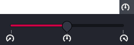

# xfce4-power-profiles-plugin

> XFCE4 panel plugin for managing power profiles (power-saver, balanced, performance).

[](https://github.com/AurelienDuval6/xfce4-power-profiles-plugin/actions/workflows/ci.yml)

[](https://www.gtk.org)
[](LICENSE)

## Overview

A lightweight XFCE panel plugin that lets you switch between power profiles directly from the panel. It communicates with `power-profiles-daemon` (and compatible backends like TLP 1.9+ or system76-power) via D-Bus.

The plugin displays a battery icon in the panel that reflects the current profile. Clicking it opens a popup with a discrete slider to switch between profiles. The icon, tooltip, and slider update automatically when the profile changes externally.

<p align="center">
  
</p>

**Supported backends:**
- [power-profiles-daemon](https://github.com/hadess/power-profiles-daemon) (default on most systemd-based distros)
- [TLP](https://github.com/linrunner/TLP) v1.9+ (with `TLP_PSM_ENABLE_DBUS=1`)
- [system76-power](https://github.com/pop-os/system76-power)

## Quick Start

### Build from source

```bash
# Install dependencies (Arch Linux)
sudo pacman -S rust gtk3 xfce4-panel pkg-config gcc

# Clone and build
git clone https://github.com/AurelienDuval6/xfce4-power-profiles-plugin.git
cd xfce4-power-profiles-plugin
bash build.sh

# Install locally
bash install.sh
xfce4-panel -r
```

Then right-click the panel → Add New Items → **Power Profiles**.

### Prebuilt packages (Debian)

`.deb` packages are attached to every release (Debian 12, Debian 13).

```bash
sudo apt install ./xfce4-power-profiles-plugin_<version>_<arch>.deb
xfce4-panel -r
```

See [Setup](docs/setup.md) for full details.

## Project Structure

```
├── src/
│   ├── lib.rs              # Entry point — XFCE panel constructor
│   ├── dbus/
│   │   ├── mod.rs          # D-Bus manager, event handling, signal monitoring
│   │   └── proxy.rs        # zbus proxy trait for PowerProfiles D-Bus interface
│   └── ui/
│       ├── mod.rs
│       └── slider.rs       # Panel button, popup window, scale widget
├── plugin.c                # C shim — required for XFCE_PANEL_PLUGIN_REGISTER macro
├── plugin.h
├── power-profiles.desktop  # Plugin descriptor for xfce4-panel
├── build.sh                # Build script (cargo + gcc)
├── install.sh              # Local user install script
├── Cargo.toml              # Rust dependencies
└── .github/
    └── workflows/
        └── ci.yml          # CI, auto version tag, and .deb packaging
```

## Documentation

- [Architecture](docs/architecture.md) — system design, data flow, tech stack
- [Setup](docs/setup.md) — prerequisites, installation, configuration
- [Changelog](docs/changelog.md) — session-by-session change log
- [Decisions](docs/decisions.md) — architecture decision records
- **API docs**: `cargo doc --no-deps` → `target/doc/powerprofiles/index.html`
